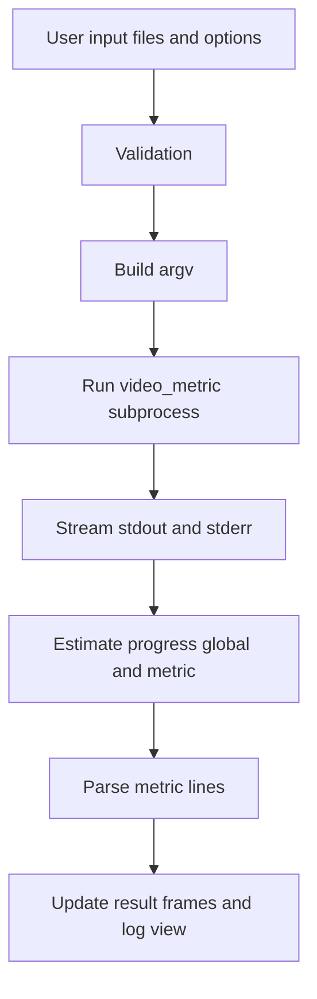

# GTK4 GUI Plan for video_metric

## Goal
Build a simple desktop GUI on top of [`video_metric`](src/main.c:92), with GTK4 as primary target on Linux and secondary support on macOS.

## MVP Scope
- Select original video file and test video file
- Select metrics: SSIM, MS-SSIM, VMAF
- VMAF resolution selector: hd or 4k
- Thread count input
- Run and Cancel controls
- Two progress bars:
  - global process progress
  - current metric progress when multiple metrics are selected
- Error message area shown only when needed
- Three metric frames SSIM MS-SSIM VMAF each with Min Max Mean labels
- Clear error/status messages

## Proposed Tech Stack
- Language: C
- GUI: GTK4
- Process execution: `GSubprocess` and async I/O
- Keep existing CLI binary unchanged initially: GUI is a wrapper

## UX Layout
- Header: App title and environment status
- Input section:
  - Original file chooser
  - Test file chooser
- Options section:
  - Metric checkboxes
  - Resolution dropdown for VMAF
  - Threads spinner
- Actions:
  - Run button
  - Cancel button
- Progress section:
  - Global progress bar and text label
  - Metric progress bar and current metric label
- Output:
  - Compact error panel hidden by default
  - Parsed results frames per metric

### Metric Result Frames
- Frame `SSIM`
  - `Min` label value
  - `Max` label value
  - `Mean` label value
- Frame `MS-SSIM`
  - `Min` label value
  - `Max` label value
  - `Mean` label value
- Frame `VMAF`
  - `Min` label value
  - `Max` label value
  - `Mean` label value

Each frame should exist from startup with placeholder values such as `-` and update only when that metric is requested and parsed.

## CLI Mapping
GUI controls map directly to CLI options from [`struct cli_options`](src/cli_options.h:51):
- Original path -> `-o`
- Test path -> `-t`
- SSIM checkbox -> `-s`
- MS-SSIM checkbox -> `-m`
- VMAF checkbox -> `-v`
- Resolution -> `-r hd|4k`
- Threads -> `-n <int>`

If no metric checkbox is selected, GUI should either:
- enforce at least one selection, or
- intentionally pass no metric flags to trigger CLI default all-metrics behavior in [`parse_cli()`](src/cli_parser.c:291).

## Architecture

### Modules
1. `ui_main.c` and `ui_main.h`
   - Build window and widgets
   - Bind callbacks
2. `app_state.c` and `app_state.h`
   - Keep current inputs, run status, results
3. `runner.c` and `runner.h`
   - Build argv
   - Launch subprocess
   - Stream stdout/stderr asynchronously
4. `output_parser.c` and `output_parser.h`
   - Parse lines like SSIM MS-SSIM VMAF stats
5. `validation.c` and `validation.h`
   - Validate paths/options before launch

### Data Flow


## Progress Model

Because [`video_metric`](src/main.c:92) does not emit numeric percent progress, GUI progress uses deterministic staged progress based on selected metrics and observed log milestones.

- Global progress bar
  - Represents full run across selected metrics
  - Step allocation by metric count
  - Example with 3 metrics: each metric contributes one third
- Metric progress bar
  - Shows active metric stage progress
  - Resets when switching from one metric to next

### Progress Milestones from CLI Output
- `Computing SSIM...` starts SSIM stage
- `SSIM - Min:` completes SSIM stage
- `Computing MS-SSIM...` starts MS-SSIM stage
- `MS-SSIM - Min:` completes MS-SSIM stage
- `Computing VMAF...` starts VMAF stage
- `VMAF - Min:` completes VMAF stage

If a metric fails, metric bar switches to error state and global bar advances to next stage with warning status.

## UI Design Variants

### Variant A Dashboard Single Window
- Top area inputs and options
- Middle area two progress bars
- Bottom area 3 side by side metric frames
- Error panel appears only on failure
- Best for fast monitoring during execution

### Variant B Wizard Like Flow
- Step 1 input files
- Step 2 options and metric selection
- Step 3 run with progress and logs
- Step 4 results page with 3 metric frames
- Best for guided usage and less clutter

### Variant C Split Pane Operator View
- Left pane controls and progress
- Right upper pane 3 metric frames in grid
- Right lower pane reserved for error messages only
- Best for power users with continuous visibility

## Recommended Variant
- Use Variant A for MVP
  - straightforward single-window structure for first release
  - always shows both progress bars and 3 metric frames together
  - error panel appears only when needed and stays hidden on success

## Final Layout Decision
- Selected by user: Variant A
- Keep no-log policy: GUI does not display runtime console logs
- Display errors only in compact error panel when a failure or warning occurs

## Validation and Error Strategy
- Before run:
  - both files selected and readable
  - metric choice policy valid
  - resolution active only when VMAF selected
  - threads integer non-negative
- During run:
  - show progress lines from CLI
  - disable editing while active
- On failure:
  - preserve logs
  - display actionable message

## Environment and Packaging Notes
- Linux primary:
  - pkg-config for `gtk4`
  - define two explicit binaries in [`Makefile`](Makefile):
    - `video_metric` for existing CLI flow from [`main()`](src/main.c:92)
    - `video_metric_gui` for GTK4 desktop wrapper
  - keep shared reusable source modules separated from entry points to avoid duplication
- macOS secondary:
  - support Homebrew GTK4 toolchain
  - document runtime dependencies clearly

## Build System Design for Two Binaries
- Keep current CLI binary behavior unchanged for backward compatibility.
- Introduce a separate GUI entry point, for example `src/gui_main.c`.
- Build outputs:
  - `video_metric`
  - `video_metric_gui`
- Recommended Makefile structure in [`Makefile`](Makefile):
  - shared object list for core logic modules
  - CLI-only object for [`main()`](src/main.c:92)
  - GUI-only objects for GTK UI and subprocess runner
  - GTK compile and link flags via `pkg-config --cflags --libs gtk4`
- Cleaning step should remove both binaries and GUI intermediate artifacts while preserving existing clean semantics.

### Suggested Target Layout
```make
all: video_metric video_metric_gui

video_metric: <core_objects> <cli_object>

video_metric_gui: <core_objects_or_wrapper_objects> <gui_objects>
```

This keeps CLI and GUI release paths independent and allows packaging either binary alone or both together.

## Incremental Delivery Plan
1. Skeleton GTK window with file pickers and options
2. Subprocess execution and log streaming
3. Parse and display SSIM/MS-SSIM/VMAF output
4. Add validation and cancel behavior
5. Update [`Makefile`](Makefile) to produce `video_metric` and `video_metric_gui`
6. Polish UX and packaging docs

## Acceptance Criteria
- User can run at least one metric from GUI and see successful metric output
- GUI displays status line and per-metric min max mean parsed values
- Invalid inputs are blocked with clear messages
- Linux build instructions are reproducible
- macOS support documented as secondary path
